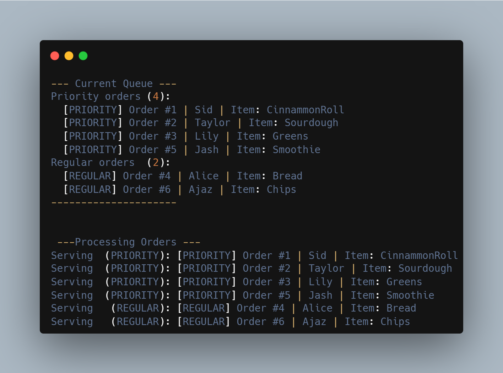

# QueueSimulator

A Java-based queue simulator that manages both regular and priority queue orders using core data structures.

## Why I Built This

I'm interested in how backend systems behave internally and how simple data structures can simulate real-world workflows. This project is part of my journey exploring Java backend systems, simulations, and developer-focused software projects.

---

## Features

- Priority and regular order handling
- FIFO (First In First Out) queue processing
- Enqueue and dequeue operations
- Queue inspection using `peek()`
- Queue visualization with `displayQueue()`
- Unique order ID generation
- Object-oriented design using separate classes

---

## Technologies Used

- Java
- Java Collections Framework
- Queue Interface
- LinkedList

---

## How to Run

1. Clone the repository

```bash
git clone https://github.com/JavaLabs-io/QueueSimulator.git
```

2. Open the project in VS Code or any Java IDE
3. Run `Main.java` from the `src/` folder

---

## Sample Output



---

## Future Improvements

- Cancel order functionality
- Search orders by ID
- JUnit tests
- GUI version
- REST API integration

---

## Part of JavaLabs-IO

This project is part of [JavaLabs-IO](https://github.com/JavaLabs-io) — a collection of Java backend systems, simulations, tools, and experimental software projects.
